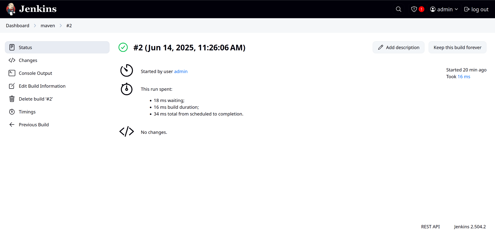
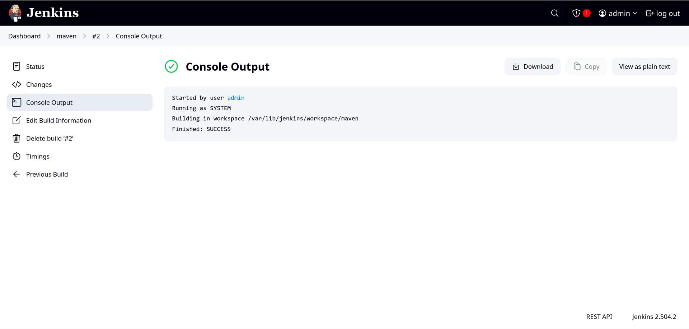

# Java Maven CI/CD Pipeline with Jenkins

This guide demonstrates how to set up a simple CI/CD pipeline for a Java Maven project using Jenkins. You will learn how to automate your build process, manage dependencies, and package your Java application—all triggered and monitored through Jenkins.

---

## Introduction

**Apache Maven** is a powerful build automation and project management tool, primarily used for Java projects. It simplifies and automates the build process, handles dependency management, compiles code, and packages applications.

**Jenkins** is a popular open-source automation server that allows you to set up continuous integration (CI) and continuous delivery (CD) pipelines. Using Jenkins with Maven streamlines your development workflow by automating repetitive tasks.

---

## Prerequisites

- Jenkins installed and running (locally or via Docker)
- Maven installed on the Jenkins server
- Java (JDK 8 or 11) installed
- A Java Maven project available in a GitHub repository

---

## Step-by-Step Setup

### 1. Install Required Jenkins Plugins

- Navigate to **Manage Jenkins > Manage Plugins**.
- Under the **Available Plugins** tab, search for and install:
  - **GitHub Integration**
  - **Maven Integration**

### 2. Create a New Jenkins Freestyle Project

- Click **New Item** on the Jenkins dashboard.
- Enter a project name (e.g., `javamaven-project`).
- Select **Freestyle project** and click OK.

### 3. Configure Source Code Management

- Under the project configuration page, scroll to **Source Code Management**.
- Select **Git**.
- Enter your GitHub repository URL.

### 4. Configure the Build Step

- Scroll to the **Build** section.
- Click **Add build step** > **Invoke top-level Maven targets**.
- Set the **Goals** field to `clean install`.
- (Optional) Specify the path to your `pom.xml` if it's not in the root directory.

### 5. Configure Post-Build Actions

- Scroll to **Post-build Actions**.
- Click **Add post-build action** > **Archive the artifacts**.
- Specify the path to your artifact (e.g., `target/*.jar` or `target/*.war`).

### 6. Build and Monitor Progress

- Save the configuration.
- Click **Build Now** to start the job.
- Monitor the build progress in the **Build History** panel.
- Click on a build number to access the **Console Output** and verify build success.

### 7. Access and Download Artifacts

- After a successful build, go to the build’s page.
- Download generated artifacts (like `.jar` files) from the **Archived Artifacts** section.

---

## Output

**Successful Build Console Output:**

---

## Summary

With this setup, you have a straightforward pipeline for building Java Maven projects using Jenkins. This process ensures that every change in your codebase is automatically built, tested, and packaged, enabling faster and more reliable software delivery.

---